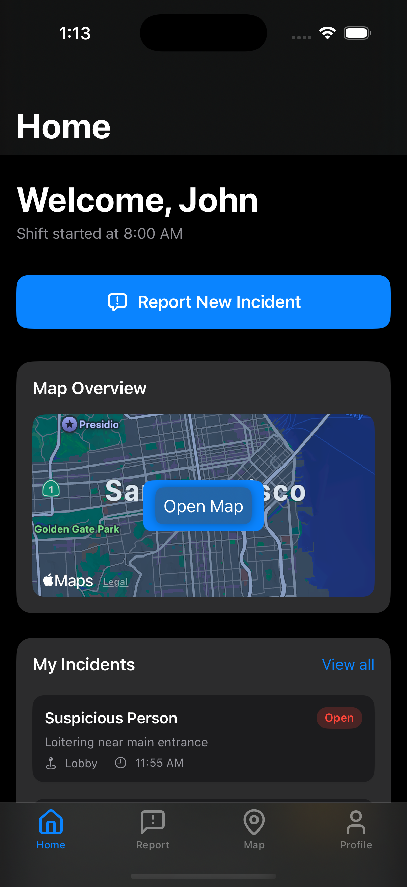
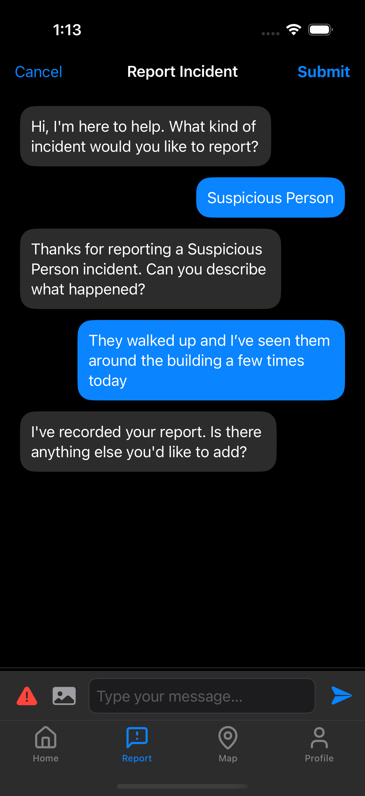
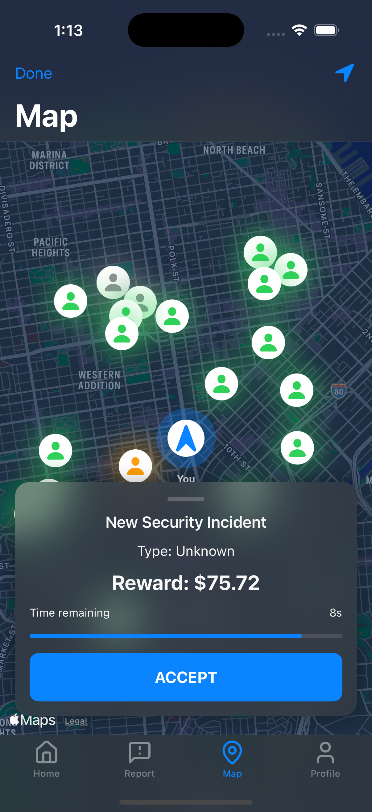
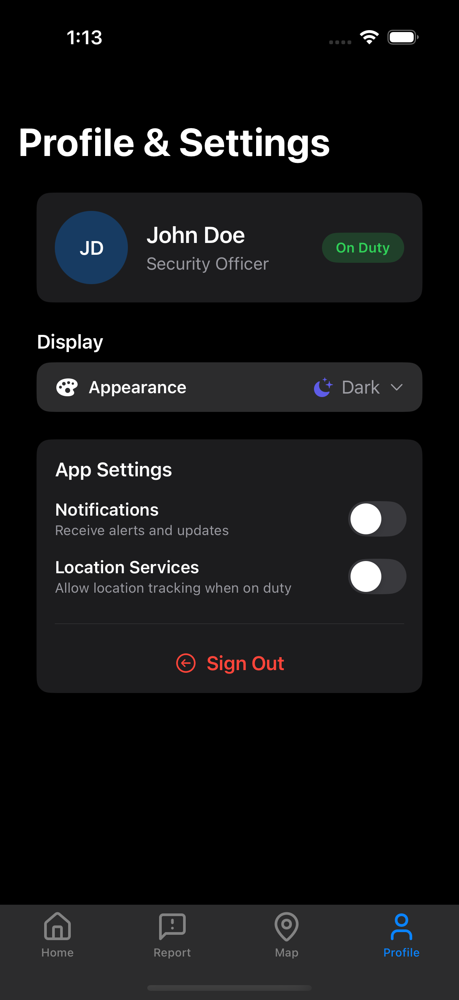

<div align="center" style="padding-bottom: 16px;">
  
  <h1>Sentinel</h1>
  <p>A secure, AI-guided incident reporting and visualization app for private security teams.</p>
</div>

## Demo

<!-- Use `docs/demo/` for image and gif demo files -->
<p align="center">
  
  
  
  
</p>

---

> Screenshots above demonstrate the app’s key UI flows:
>
> - **Home**: Overview and quick actions.
> - **Report**: Step-by-step guided incident reporting chat.
> - **Map**: Animated, interactive incident pins.
> - **Profile**: User settings and appearance customization.

## Setup

1. **Clone the repository**

   ```bash
   git clone https://github.com/encodexdev/sentinel.git
   cd sentinel
   ```

2. **Configure your API Key**

   Sentinel uses a secure approach to manage your OpenAI API key with multiple fallback methods:

   **Option 1: Using Xcode Configuration (Build-time Injection)**

   ```bash
   # Copy the example config file
   cp Config/Secrets.xcconfig.example Config/Secrets.xcconfig
   # Edit the file to add your API key
   open Config/Secrets.xcconfig
   ```

   Edit the file to set your OpenAI API key:

   ```
   OPENAI_API_KEY = your_openai_api_key_here
   ```

   **IMPORTANT:** After updating the Secrets.xcconfig file, you must:
   
   1. Clean the build folder (Product → Clean Build Folder)
   2. Close and reopen Xcode
   3. Build and run the project

   **Option 2: Using Environment Variables**

   This approach is good for local development and CI/CD:

   - In Xcode, go to Product → Scheme → Edit Scheme...
   - Under the Run phase, expand Arguments → Environment Variables
   - Add `OPENAI_API_KEY` with your key as the value
   
   When the app runs with this environment variable, it will automatically store the key securely in the iOS Keychain for future use.

   **Option 3: iOS Keychain Storage (Runtime)**

   The most secure option - once you've run the app with a valid API key:
   
   1. The key is securely stored in the iOS Keychain
   2. Future app launches automatically retrieve it
   3. No need to reconfigure the key unless it changes
   
   > ⚠️ **Security Note:** Your API key is stored securely in the iOS Keychain and never committed to version control.

3. **Open in Xcode**

   ```bash
   open Sentinel.xcodeproj
   ```

4. **Build and Run**
   - Target: iOS 18.0 or later
   - Scheme: `Sentinel`
