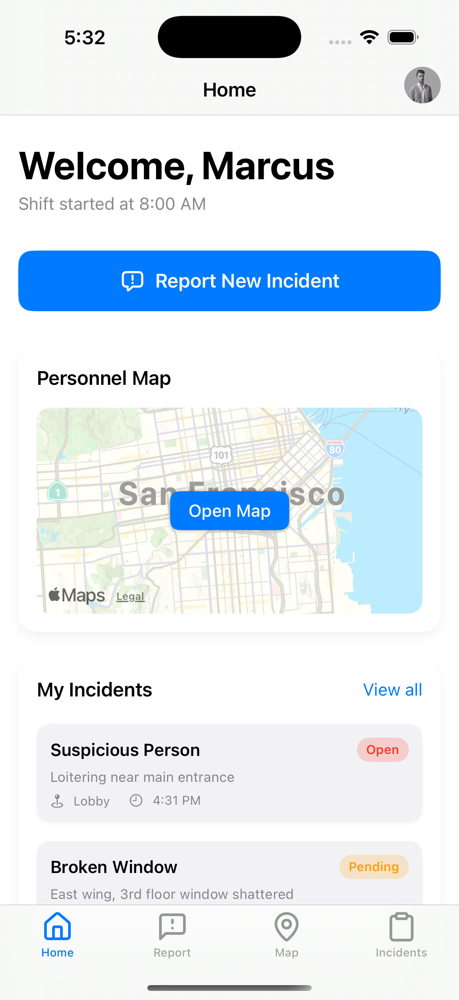
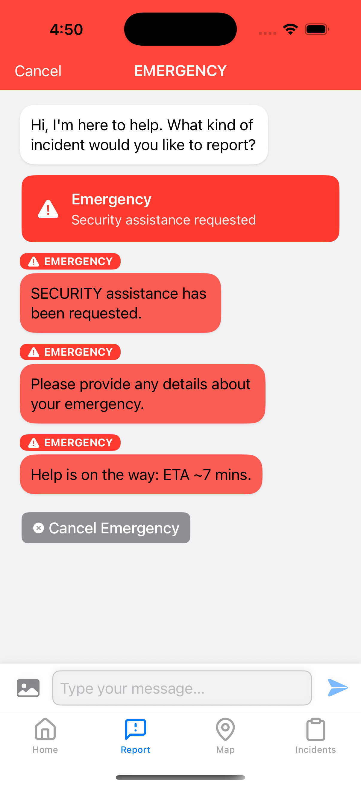
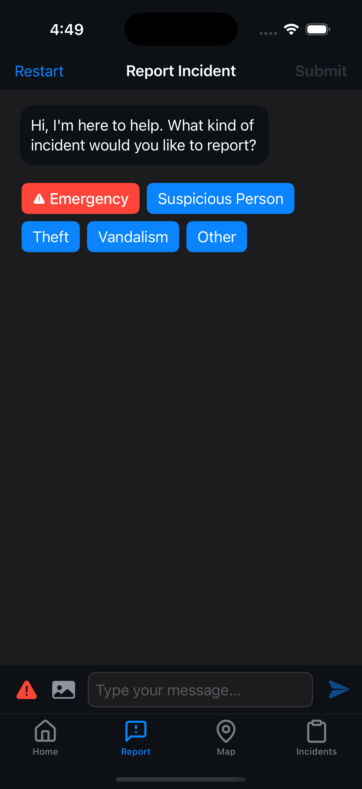
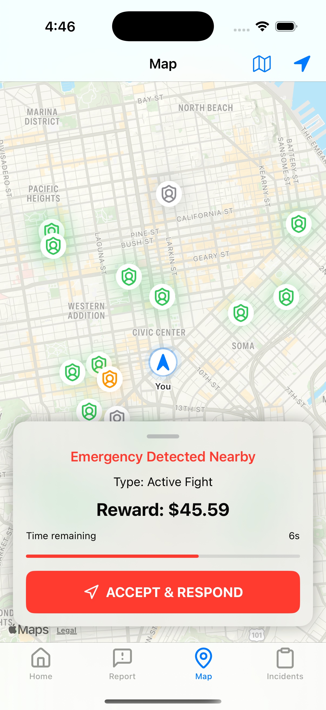
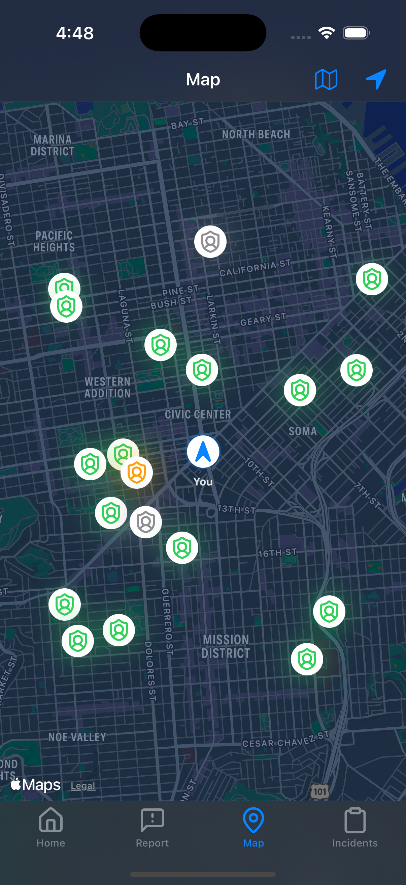
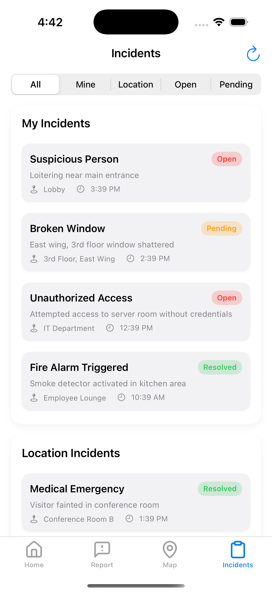
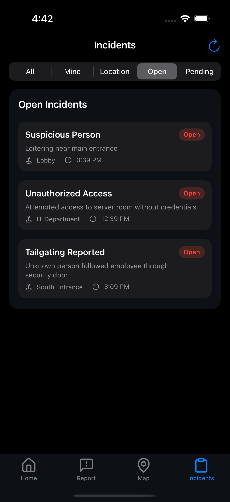
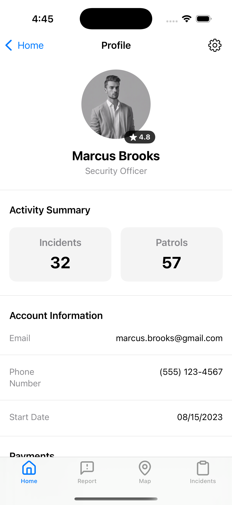
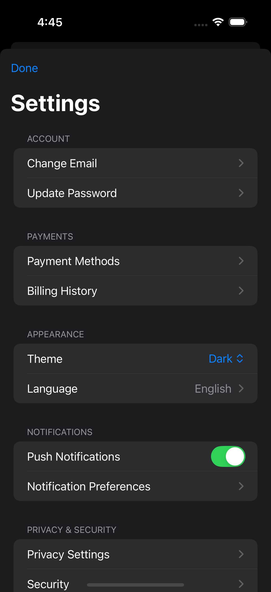

<div align="center" style="padding-bottom: 16px;">
  
  <h1>Sentinel</h1>
  <p>A secure, AI-guided incident reporting and visualization app for private security teams.</p>
</div>

## Demo Tour

<div align="center">
  <table>
    <tr>
      <td align="center"><b>Home Dashboard</b></td>
      <td align="center"><b>Map Navigation</b></td>
    </tr>
    <tr>
      <td></td>
      <td><video src="docs/demo/map_dark_demo.mp4" width="280" autoplay loop muted style="border-radius: 8px;"></video></td>
    </tr>
  </table>
</div>

#### Videos to Add:

1. **`chat_normal_flow.mp4`** - Show the standard incident reporting flow:

2. **`chat_emergency_flow.mp4`** - Demonstrate emergency response workflow:

3. **`chat_image_upload.mp4`** - Show image attachment functionality:

4. **`chat_report_generation.mp4`** - Demonstrate report creation:

### Smart Incident Reporting

AI guides security personnel through structured incident reporting with multimodal capabilities and intelligent prompting.

<div align="center">
  <table>
    <tr>
      <td align="center"><b>Emergency Mode</b></td>
      <td align="center"><b>Chat Interface</b></td>
    </tr>
    <tr>
      <td></td>
      <td></td>
    </tr>
  </table>
</div>

### Interactive Map Experience

Real-time incident tracking with interactive pins and location-based alerts.

<div align="center">
  <table>
    <tr>
      <td align="center"><b>Incident Acceptance</b></td>
      <td align="center"><b>Incident Map</b></td>
    </tr>
    <tr>
      <td></td>
      <td></td>
    </tr>
  </table>
</div>

### Incidents Management

View, filter, and manage all incidents in a centralized dashboard.

<div align="center">
  <table>
    <tr>
      <td align="center"><b>Light Mode</b></td>
      <td align="center"><b>Dark Mode</b></td>
    </tr>
    <tr>
      <td></td>
      <td></td>
    </tr>
  </table>
</div>

### User Profile & Settings

Customizable user settings with appearance preferences and notification controls.

<div align="center">
  <table>
    <tr>
      <td align="center"><b>Profile</b></td>
      <td align="center"><b>Settings</b></td>
    </tr>
    <tr>
      <td></td>
      <td></td>
    </tr>
  </table>
</div>

## Technology Stack

- **Frontend**: SwiftUI with MVVM architecture
- **AI Integration**: OpenAI API with GPT-4 Vision capabilities
- **Geolocation**: MapKit with custom annotations
- **Security**: Local keychain storage for sensitive data

## Setup

1. **Clone the repository**

   ```bash
   git clone https://github.com/encodexdev/sentinel.git
   cd sentinel
   ```

2. **Configure your API Key**

   **Option 1: Using Xcode Configuration (Build-time Injection)**

   ```bash
   # Copy the example config file
   cp Config/Secrets.xcconfig.example Config/Secrets.xcconfig
   # Edit the file to add your API key
   open Config/Secrets.xcconfig
   ```

   Edit the file to set your OpenAI API key:

   ```
   OPENAI_API_KEY = your_openai_api_key_here
   ```

   **IMPORTANT:** After updating the Secrets.xcconfig file, you must:

   1. Clean the build folder (Product → Clean Build Folder)
   2. Close and reopen Xcode
   3. Build and run the project

   **Option 2: Using Environment Variables**

   This approach is good for local development and CI/CD:

   - In Xcode, go to Product → Scheme → Edit Scheme...
   - Under the Run phase, expand Arguments → Environment Variables
   - Add `OPENAI_API_KEY` with your key as the value

   When the app runs with this environment variable, it will automatically store the key securely in the iOS Keychain for future use.

3. **Open in Xcode**

   ```bash
   open Sentinel.xcodeproj
   ```

4. **Build and Run**
   - Target: iOS 18.0 or later
   - Scheme: `Sentinel`

## Development Roadmap

- [ ] Push notification integration for emergency alerts
- [ ] Advanced image recognition for automatic incident classification

## Known Issues

- [ ] Theme toggle no longer switches instantly
- [ ] Switching to the map tab and quickly back causes an app freeze
