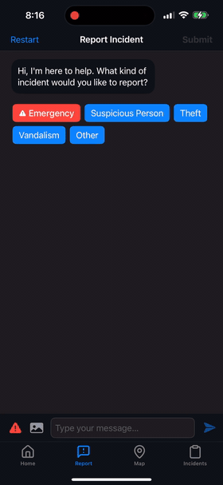

<div align="center" style="padding-bottom: 16px;">


# Sentinel

_A secure, AI-guided incident reporting and visualization app for private security teams._

</div>

---

<p align="center">
  <a href="#demo">Demo</a> •
  <a href="#features">Features</a> •
  <a href="#installation">Installation</a> •
  <a href="#usage">Usage</a> •
  <a href="#tech-stack">Tech Stack</a> •
  <a href="#roadmap">Roadmap</a> •
  <a href="#known-issues">Known Issues</a>
</p>

---

## Demo

<p align="center">
  
  
</p>
<p align="center"><em>Standard views and interactive map demo.</em></p>

<details open>
  <summary><strong>AI-Powered Chat Interface</strong></summary>
  <p align="center">
    
    
  </p>
  <p align="center"><em>Standard vs. Emergency reporting with smart AI assistance.</em></p>
</details>

<details open>
  <summary><strong>Smart Incident Reporting</strong></summary>
  <p align="center">
    
    
  </p>
  <p align="center"><em>Structured prompts ensure completeness and context.</em></p>
</details>

<details open>
  <summary><strong>Interactive Map Experience</strong></summary>
  <p align="center">
    
    
  </p>
  <p align="center"><em>Real-time pins and location-based alerts.</em></p>
</details>

<details open>
  <summary><strong>Incidents Management</strong></summary>
  <p align="center">
    
    
  </p>
  <p align="center"><em>Filter, view, and resolve incidents in one place.</em></p>
</details>

<details open>
  <summary><strong>User Profile & Settings</strong></summary>
  <p align="center">
    
    
  </p>
  <p align="center"><em>Customize appearance, notifications, and more.</em></p>
</details>

---

## Features

- **Emergency Mode**: Priority workflows with real-time feedback.
- **Interactive Map**: Live incident tracking and alerts.
- **Incidents Dashboard**: Filter, assign, and manage reports.
- **Profile & Settings**: Customize appearance and notifications.
- **Secure**: Keys stored in local keychain; no sensitive data leaks.

---

## Installation

1. Clone the repo:
   ```bash
   git clone https://github.com/encodexdev/sentinel.git
   cd sentinel
   ```
2. Install dependencies (Swift Package Manager).
3. Configure your OpenAI API key:
   - Copy `Config/Secrets.xcconfig.example` to `Config/Secrets.xcconfig`.
   - Add `OPENAI_API_KEY = your_key_here`.
4. Open in Xcode and run (iOS 18+).

---

## Tech Stack

- **Frontend**: SwiftUI & MVVM
- **AI**: OpenAI GPT-4 Vision
- **Maps**: MapKit with custom annotations
- **Security**: iOS Keychain

---

## Roadmap

- Push notifications for emergencies
- Advanced image-based incident classification

---

## Known Issues

This project is built as a visual demo for UI/UX design and is not production ready. Beyond the security updates, backend integration and more, here are some known issues with the current build that I didn't have time to address:

- [ ] Theme toggle no longer switches instantly
- [ ] Switching to the map tab and quickly back causes an app freeze
- [ ] OPENAI_API_KEY needs to be added through the product scheme
